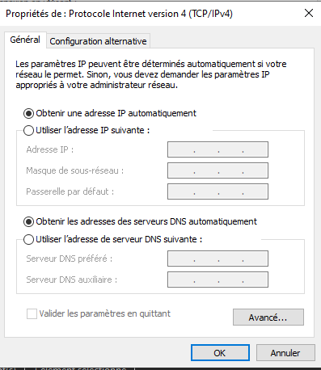
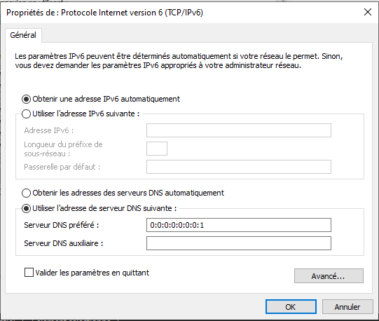

Clone project in home:

`git clone https://github.com/Vincere1st/ddb-wsl2.git`

`cd ddb-wsl2`

`bash docker-installer.sh`

At the end logout (type exit) and restart Ubuntu

`cd ddb-wsl2`

`bash ddb-installer.sh`

- Logout again and stop Ubuntu completly (wsl --shutdown Ubuntu) and restart Ubuntu

- After that 2 solutions present in front you

  - First solution is to edit as administrator the Windows hosts file
    
    Add this lines and don't forget to add for all new project the syntax 127.0.0.1 url <name-project>.test  
    
        127.0.0.1 portainer.test
        127.0.0.1 traefik.test
    
  - Second solution install AcrylicDns, but we do configure the application and the network adapter because AcrylicDns use the port 53 and WSL2 also.
    
    Follow the instruction:
    - Download and install AcrylicDns: https://mayakron.altervista.org/support/acrylic/Home.htm
    
    - Open Acrylic UI
    and click File>Open Acrylic Configuration or CTRL+F1
    and search the line: `LocalIPv4BindingPort=53` 
    
        - Set the port to 54 for example (it's my case)so line is:
    `LocalIPv4BindingPort=54`
    
        - Do not touch the configuration for `LocalIPv6BindingPort=53` it's not necessary
        - /!\ Do not forget save! Before doing the next instruction
        - Clik NO for restart in prompt
        - Click FILE>OPEN ACRYLIC HOSTS
        - At the end of file add 127.0.0.1 *.test
        - Save
        - Clik YES for restart in prompt
        - Close Acrylic UI
    
    - Now we configure Windows 
        - Go to Network and Sharing Center > Change Adapter Settings
        - Right Click on your Network and select Properties 
        - Make sure your IPV4 DNS settings match this for IPV4:
    
          

  - AND for IPV6:
  

  

Restart Ubuntu completely `wsl --shutdown Ubuntu`

And normally all works: 

In case of at start of Ubuntu you have this error:
error: 0xffffffff
This appear if the port 53 is use by another program.
Prehaps it's is Acrylic DNS, so to test stop Acrylic DNS, and restart Ubuntu,  and if that uninstall Acrylic DNS the Windows Host file or try to configure the IPV6 port to 54 in configuration of Acrylic DNS.

Go to chrome and go to https://traefik.test or https://portainer.test

Enjoy!

Thks to Rodolphe Habegger for initialize the shell project: https://github.com/rhabegger

Thks to Damion Gans for the systemd in WSL2 here:  https://github.com/DamionGans/ubuntu-wsl2-systemd-script.git

Thks to Jawabuu for the solution to working WSL2 and Acrylic DNS at same time:
https://github.com/microsoft/WSL/issues/4364#issuecomment-766760961
